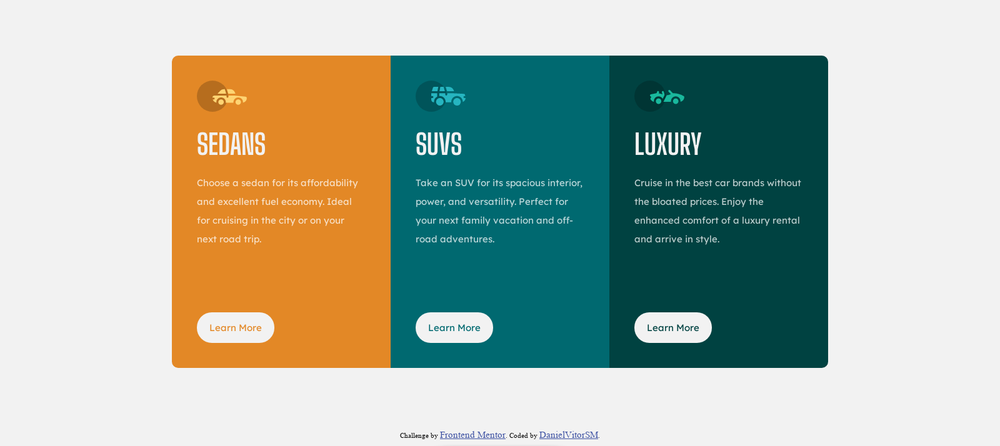

# Frontend Mentor - Solução 3-column preview card component

Essa é uma soluçaõ para [3-column preview card component challenge on Frontend Mentor](https://www.frontendmentor.io/challenges/3column-preview-card-component-pH92eAR2-). Os desafios do FrontEnd Mentor te ajuda a impulsionar as habilidades de codigo para projetos realistas.

## Sumário

- [Visão Geral](#overview)
  - [O Desafio](#the-challenge)
  - [Screenshot](#screenshot)
- [Processo](#my-process)
  - [Construído com](#built-with)
  - [Oque eu Aprendi](#what-i-learned)
- [Autor](#author)
- 

## Overview

### O Desafio

As informações devem estar dispostas em Cards e deve permitir com que o usuário obtenha mais dados sobre cada uma, o layout deve ser responsivo e se adaptar no mobile e telas menores.

### Screenshot

## Processo
Primeiro procurei separar os elementos em divs e seções para poder customizar com o CSS, depois organizei os textos e imagens e comecei a personalizar dos elementos maiores e mais genéricos para os menores.

### Construido com

- Propriedades customizadas em CSS
- Flexbox

### Oque eu aprendi

Antigamente eu usava continuamente porcentagens para manter a proporção e fazer a responsividade, porém neste projeto percebi que nem sempre esse método funciona e que pode prejudicar o layout da página. Portanto preferi usar widths e heights físicas para manter o aspecto do card e manter a porcentagem apenas em telas menores, próximas de 300px de largura.

## Author

- Website - [DanielVitorSM](https://danielvitorsm.tk)
- Frontend Mentor - [@danielvitorsm](https://www.frontendmentor.io/profile/DanielVitorSM)
- Instagram - [@danielvitorsm](https://www.instagram.com/danielvitorsm)